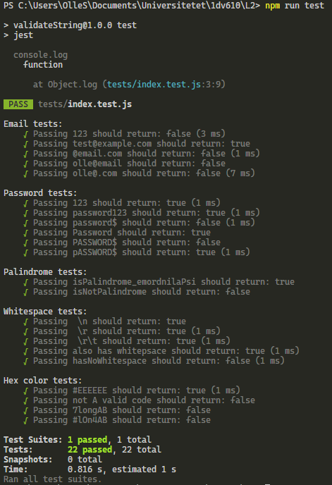

#Tests for the validateString module library
These tests are written with the help of hte Jest npm module in order to automate them, in order to run the tests you must first install Jest using `npm i` and then run them using `npm run test`.

###All of the written tests pass and the functions that has been tested are:
>isEmail()
>isPassword()
>isPalindrome()
>hasWhitespace()
>isHexColor()

